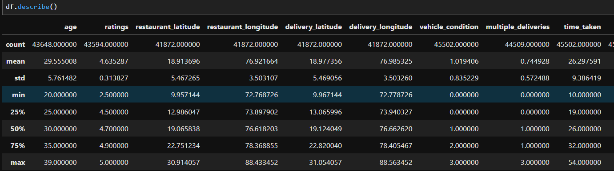
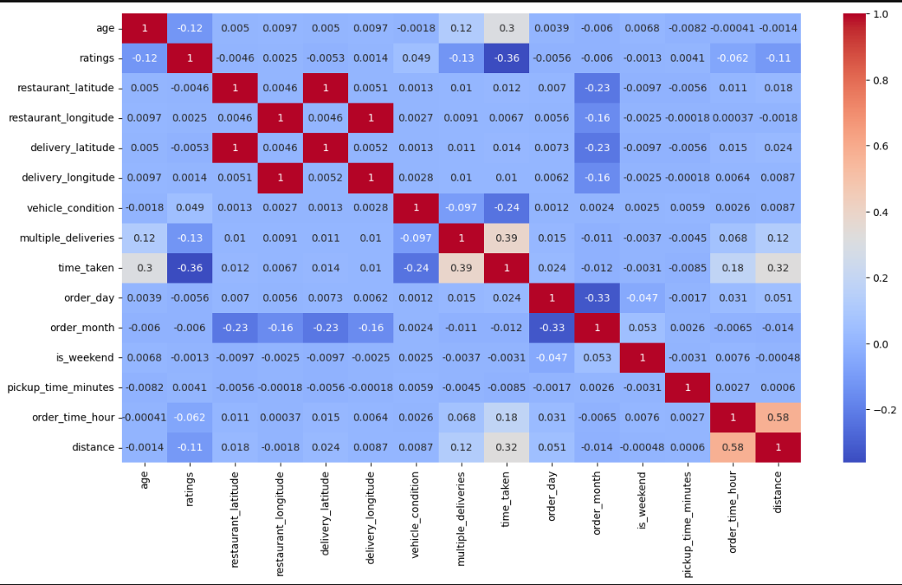
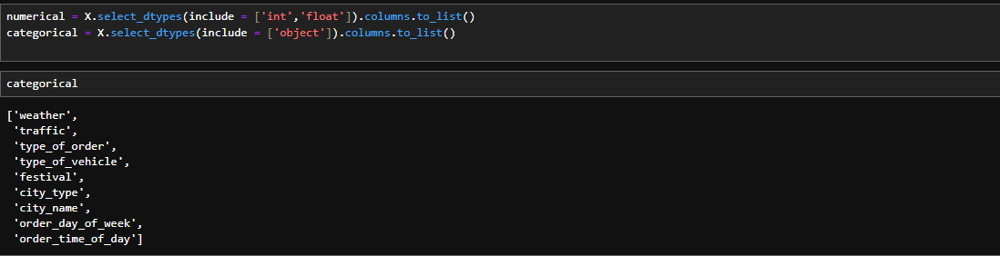
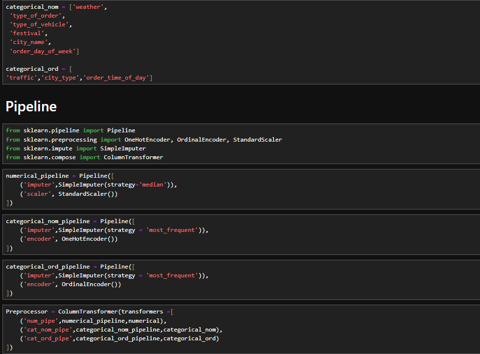
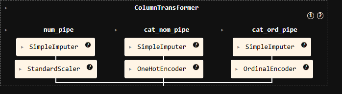
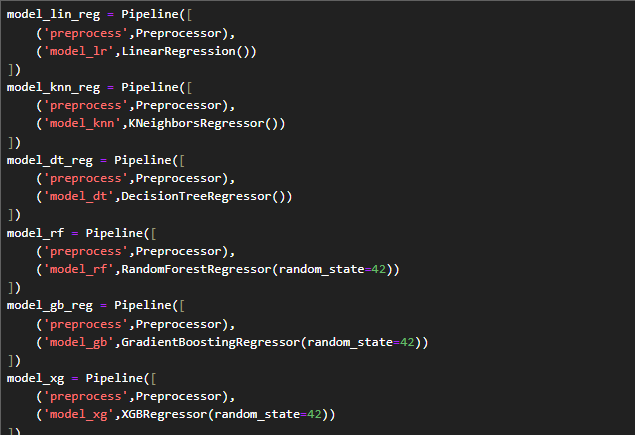
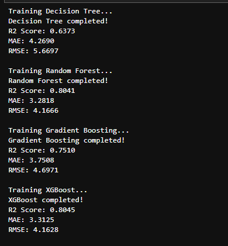
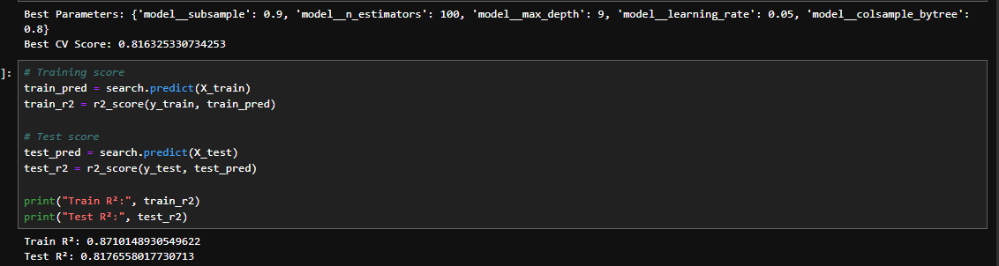

# 🍔 Swiggy Delivery Time Prediction

A machine learning project that predicts **food delivery time in minutes** based on order, delivery partner, traffic, weather, location, vehicle, and time-related information.

The project includes a trained machine learning model and a **Streamlit web application** that allows users to enter delivery details and receive an estimated delivery time.

## 🚀 Demo

The application provides an interactive interface where users can enter delivery information and click **Predict Delivery Time** to get the estimated delivery duration.

**Prediction output:** Delivery time in minutes.

## 📌 Project Overview

Accurately estimating food delivery time is important for improving customer experience and delivery operations.

This project uses historical Swiggy delivery data to build a regression model that learns relationships between delivery conditions and actual delivery time.

The application takes factors such as:

* Delivery partner age and rating
* Weather conditions
* Traffic conditions
* Vehicle condition and type
* Type of order
* Number of multiple deliveries
* Festival status
* City type and city
* Order date and time
* Pickup time
* Delivery distance

and predicts the expected delivery time.

## 🧠 Machine Learning Workflow

The project follows a typical machine learning pipeline:

```text
Raw Delivery Data
       ↓
Data Cleaning & Preprocessing
       ↓
Feature Engineering
       ↓
Categorical Feature Encoding
       ↓
Model Training
       ↓
Model Evaluation
       ↓
Trained Model (.pkl)
       ↓
Streamlit Application
       ↓
Delivery Time Prediction
```

The model is trained separately in `swiggy.ipynb` and the resulting trained model is stored as `swiggy_model.pkl`.

## 📂 Project Structure

```text
swiggy-delivery-time-prediction/
│
├── app.py                    # Streamlit application
├── swiggy.ipynb              # Data analysis and model training notebook
├── swiggy_demographic.csv    # Delivery dataset
├── swiggy_model.pkl          # Trained machine learning model
├── requirements.txt          # Python dependencies
└── README.md                 # Project documentation
```

## 📊 Input Features

The Streamlit application accepts the following features:

| Feature               | Description                                   |
| --------------------- | --------------------------------------------- |
| `age`                 | Delivery partner age                          |
| `ratings`             | Delivery partner rating                       |
| `weather`             | Current weather condition                     |
| `traffic`             | Traffic level                                 |
| `vehicle_condition`   | Condition of the delivery vehicle             |
| `type_of_order`       | Type of food order                            |
| `type_of_vehicle`     | Delivery vehicle                              |
| `multiple_deliveries` | Number of deliveries handled together         |
| `festival`            | Whether the order is placed during a festival |
| `city_type`           | Type of city                                  |
| `city_name`           | Delivery city                                 |
| `order_day`           | Day of the month                              |
| `order_month`         | Order month                                   |
| `order_day_of_week`   | Day of the week                               |
| `is_weekend`          | Whether the order is on a weekend             |
| `pickup_time_minutes` | Estimated pickup time                         |
| `order_time_hour`     | Hour at which the order was placed            |
| `order_time_of_day`   | Time period of the order                      |
| `distance`            | Delivery distance in kilometers               |

## Key Findings






## Technical Implementation



## Methodology


*All visualizations generated from notebook analysis* 

*Generated with Jupyter Notebook (v6.4.5) and Streamlit dashboard*

## 🛠️ Tech Stack

* **Python**
* **Pandas** — data manipulation
* **NumPy** — numerical computing
* **Scikit-learn** — machine learning
* **XGBoost** — gradient boosting model
* **SciPy** — scientific computing
* **Joblib** — model-related utilities
* **Streamlit** — interactive web application

The repository pins the core ML dependencies in `requirements.txt`, including NumPy, Pandas, Scikit-learn, SciPy, XGBoost, and Joblib.

## ⚙️ Installation

### 1. Clone the repository

```bash
git clone https://github.com/AION26/swiggy-delivery-time-prediction.git
cd swiggy-delivery-time-prediction
```

### 2. Create a virtual environment

```bash
python -m venv venv
```

Activate it:

**Windows**

```bash
venv\Scripts\activate
```

**macOS / Linux**

```bash
source venv/bin/activate
```

### 3. Install dependencies

```bash
pip install -r requirements.txt
```

The Streamlit application also requires Streamlit:

```bash
pip install streamlit
```

> **Note:** `streamlit` is imported by `app.py` but is not currently listed in `requirements.txt`.

## ▶️ Run the Application

Start the Streamlit application with:

```bash
streamlit run app.py
```

Streamlit will provide a local URL, typically:

```text
http://localhost:8501
```

Open the URL in your browser to use the prediction interface.

## 🔮 How to Use

1. Start the Streamlit application.
2. Enter the delivery partner's age and rating.
3. Select the weather and traffic conditions.
4. Select vehicle and order information.
5. Enter the city and order timing information.
6. Enter the delivery distance.
7. Click **Predict Delivery Time**.
8. The application displays the predicted delivery time in minutes.

The current application loads `swiggy_model.pkl` directly and passes the collected inputs to the model for prediction.

## 📓 Model Development

The `swiggy.ipynb` notebook contains the machine learning workflow used to analyze the delivery dataset and develop the prediction model.

The trained model is saved as:

```text
swiggy_model.pkl
```

The application loads this model at startup:

```python
with open("swiggy_model.pkl", "rb") as f:
    model = pickle.load(f)
```

and generates the prediction using:

```python
prediction = model.predict(input_df)
```

## 📁 Dataset

The project includes `swiggy_demographic.csv`, a delivery dataset used for model development. The file is approximately **7.7 MB** in the repository.

The dataset contains information related to delivery partners, orders, locations, traffic, weather, vehicles, and delivery conditions.

## 🎯 Use Cases

A delivery-time prediction model can help food-delivery platforms:

* Provide customers with more accurate ETA estimates
* Improve delivery planning
* Identify factors contributing to longer delivery times
* Support delivery partner allocation
* Improve operational efficiency
* Enhance customer satisfaction

## 🔧 Future Improvements

Potential improvements to the project include:

* Add model performance metrics such as MAE, RMSE, and R² to the README
* Compare multiple regression algorithms
* Perform systematic hyperparameter tuning
* Add visualizations for feature importance
* Improve input validation in the Streamlit application
* Add automated model retraining
* Deploy the application to Streamlit Community Cloud or another hosting platform
* Add prediction confidence or an estimated delivery-time range
* Add automated tests for the prediction pipeline
* Add `streamlit` to `requirements.txt` for easier installation

## 📌 Limitations

The prediction is dependent on the quality and distribution of the historical training data.

Real-world delivery time can also be affected by factors that are difficult to capture, such as:

* Unexpected traffic
* Restaurant preparation delays
* Road closures
* Weather changes
* Delivery partner availability
* Order batching
* Unusual demand spikes

Therefore, predictions should be treated as estimates rather than guaranteed delivery times.

## 🤝 Contributing

Contributions are welcome.

1. Fork the repository.
2. Create a new branch:

```bash
git checkout -b feature/your-feature
```

3. Make your changes.
4. Commit your changes:

```bash
git commit -m "Add your feature"
```

5. Push the branch:

```bash
git push origin feature/your-feature
```

6. Open a Pull Request.

## 📄 License

No license file is currently included in the repository. If you intend to distribute or reuse this project, consider adding an appropriate open-source license.

## 👨‍💻 Author

**AION26**

GitHub: https://github.com/AION26

## ⭐ Support

If you find this project useful, consider giving the repository a ⭐ on GitHub.

Repository: https://github.com/AION26/swiggy-delivery-time-prediction
